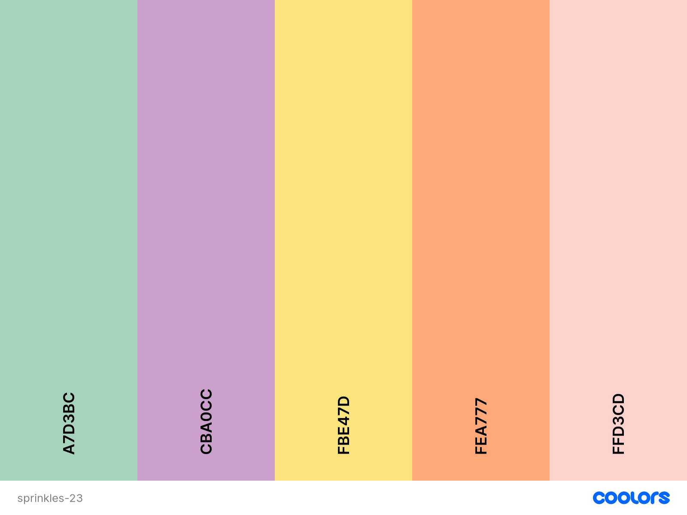
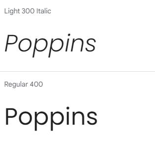

# Hobby

This is a website for Hobby, a fictional recreational directory. The main purpose of the website is to easily connect hobbyists with facilitators alike.

It is designed with ease of access in mind. This website exists to showcase hobby facilitators in your area that may otherwise go unheard of. It is to highlight the presence of businesses, clubs and activities you may not know exist due to a lack of online presence.

[View Hobby here](https://katemcguane.github.io/hobby/index.html)

## Table of Contents

- [User Experience (UX)](#user-experience-ux)
    - [User Stories](#user-stories)
      - [Client Goals](#client-goals)
      - [Visitor Goals](#visitor-goals)

- [Design](#design)
  - [Colour Scheme](#colour-scheme)
  - [Typography](#typography)
  - [Imagery](#imagery)
  - [Favicon](#favicon)
  - [Wireframes](#wireframes)

- [Features](#features)
  - [Existing Features](#existing-features)
    - [Summary of Pages](#summary-of-pages)
    - [Reoccuring Page Features](#reoccuring-page-features)
  - [Future Implementations](#future-implementations)
  - [Accessibility](#accessibility)

- [Technologies Used](#technologies-used)
  - [Languages Used](#languages-used)
  - [Frameworks, Libraries \& Programs Used](#frameworks-libraries--programs-used)

- [Deployment \& Local Development](#deployment--local-development)
  - [Deployment](#deployment)
  - [Local Development](#local-development)
    - [How To Fork](#how-to-fork)
    - [How To Clone](#how-to-clone)

- [Testing](#testing)

- [Credits](#credits)
  - [Markup](#markup)
  - [Code Used](#code-used)
  - [Content](#content)
  - [ Media](#media)
  - [ Acknowledgments](#acknowledgments)

---

## User Experience (UX)

### User Stories

#### Client Goals

- To be able to view the site on a range of device sizes.
- To serve as a community directory for hobbies, and link hobbyists with facilitators.
- To link in with users in the form of a newsletter.
- To direct visitors to our socials.

#### Visitor Goals

- I want to find out what Hobby is, and if it has the activity that I'm looking for.
- I want a website that's easy to navigate.
- I want to find the information I'm looking for with ease.
- I want to be able to find and follow Hobby on socials.

---

## Design

The website is designed with three separate pages. This is to ensure ease of use, and for the length of each page to remain concise on a mobile device. The website is a directory and will be used as a hub for quick access to facilities and respective socials.

### Colour Scheme

There is a great emphasis on colour for this website. I wanted it to reflect the positive association that can be had with hobbies. I wanted it to be playful for children and adults alike; perhaps even evoke a sense of nostalgia for older users. 
The colour scheme of the website illustrates variety and fun through the colour palette. 100s of Thousands were the inspiration for this palette of choice. 

This palette holds the pastel colours found in the hero image. They are used throughout the website where a solid colour is needed to make wording stand out from the hero image behind it. Many of the colours were extracted from this image and are accented throughout the website.

This palette extracts the more vibrant colours found in the hero image. It is used primarily for defining elements such as headings, areas of importance or quick reference. 

Both colour palettes were created using the [Coolors](https://coolors.co/) website. 

### Typography

[Fredericka The Great](https://fonts.google.com/specimen/Fredericka+the+Great?preview.text=Fredericka%20The%20Great&query=Poppins)

  - This font has an illustration-type quality to it, which reflects the theme of the website. It adds some fun, looks hand-drawn and mirrors the chosen style of favicon. It is illustrative, yet has a structural integrity and readability to it. Furthermore, it effortlessly reflects what the website is about. This is primarily used for the website heading "Hobby".

[Poppins](https://fonts.google.com/specimen/Poppins?preview.text=Poppins&query=Poppins)

  - This is a legible, sans serif font with many varieties of weight to choose from. It is versatile and accomodates all structural styling needs. It is a very accessible font, and easy to read. This is used for more word heavy content sections of the website. 

Both fonts were sourced from [Google Fonts](https://fonts.google.com/).

### Imagery

All images were source from [Raw Pixel](https://www.rawpixel.com/).

### Favicon

I designed this favicon especially for the webpage using [Canva](https://www.canva.com/). I chose an illustrated 'h'. This was the best way to reflect the nature of the website. The paintbrush icon used in the header was also a contender (along with other hobby - related instruments), however it did not translate as clearly on the broswer tab compared to lettering. The 'h' has an illustrative quality to it, again reflecting the theme and typographies used throughout.

### Wireframes

Wireframes were created for desktop (1920px x 1080px), iPad (768px x 1024px) and iPhone 12Pro (436px x 867px).

#### __Home Page__

#### __Gallery Page__

#### __Sign Up Page__

---

## Features

| Page | Existing Features | Future Implementations |
| :--- | :--- | :--- |
| All Pages | * The navigation bar is visible on all pages. It is kept white so as to remain clear. The favicon styles are refelcted in the header. There is a paintbrush icon to give an idea as to what the page is about. This has a toggle feature that links to each page when using smaller devices.  * Each page features a hero image of sprinkles with other information being layered on top.  * Block colours are used where there's writing so they do not get lost in the sprinkles background.  * The footer is a focal point that stands out clearly with a white background. This is carried throughout each page as it is essential to create a strong social following as the concept of the website is community-based. | Once data is collected from those wanting to promote their business, club or facility it could be implemented across the website. This would include:  * Links to their socials, webpages, features and contact details.  * A map feature could be added with all associated organisations. |
| About | General landing page that describes what the website & what it is about. | Add an image carousel  
| Discover | Features a gallery of the hobbies that the website is connected to. They are displayed in rows of three on desktop and collapse responsively with decreasing screen size. This page illustrates what is available through the website with simple visual cues. |
| Sign Up | Features a one-way means of contact. This would meet the needs of the website on it's first phase as a relatively static website. The purpose of this feature is to collect potential customer and facilitator contact information. |
| Response | The Response page is only activated when the user clicks the 'Subscribe' button for the signup page. |

### Future Implementations

Aspects that could elevate the current website:

- Link in real-life businesses.
- Add a map feature on the discover page to said businesses.
- Add contact informtion.

The current website acts as a free directory. There is potential to devleop the concept further by:

- Adding a login page whereby the user can review the listed businesses.
  - - Add filter column to the directory with features such as "Onsite Parking", "Wheelchair Accessible" and "Sensory Friendly" to name a few. This way people can find the best service to suit their essential needs.
- Integrating e-commerce to the website where businesses can opt-in to sell from the website if they do not have one themselves.
- Create an app version of the website that makes its easy for all user types.

### Accessibility

The entire website was designed with a responsive-first ethos in mind. Some best practices implemented were:

 * Using semantic HTML

---

## Technologies Used

### Languages Used

HTML & CSS were used to create this website.

### Frameworks, Libraries & Programs Used

- [Codeanywhere](https://codeanywhere.com/) - Initial IDE used; transferred to VS Code midway.
- [GitHub](https://github.com/)
- [Google Fonts](https://codeanywhere.com/signin)
- [Font Awesome](https://fontawesome.com/)
- [Canva](https://www.canva.com/)
- [Favicon.io](https://favicon.io/favicon-converter/)
- [Coolors](https://coolors.co/)
- [Raw Pixel](https://www.rawpixel.com/)

---

## Deployment & Local Development

### Deployment

The site was deployed early using Github Pages. The is how the live site was deployed:

1. Log in (or sign up) to Github.
2. Find the repository for this project, [Kate McGuane / hobby](https://github.com/KateMcGuane/hobby).
3. Click on the Settings link.
4. Click on the Pages link in the left hand side navigation bar.
5. In the Source section, choose main from the drop down select branch menu. Select Root from the drop down select folder menu.
6. Click Save. Your live Github Pages site is now deployed at the URL shown.

### Local Development

#### How to Fork

To fork the Hobby repository:

1. Log in (or sign up) to Github.
2. Go to the repository for this project, [Kate McGuane / hobby](https://github.com/KateMcGuane/hobby).
3. Click the Fork button in the top right corner. This action will create a copy of the repository under your GitHub account.

#### How to Clone

To clone the Hobby repository:

1. Log in (or sign up) to GitHub.
2. Go to the repository for this project, [Kate McGuane / hobby](https://github.com/KateMcGuane/hobby).
3. Click on the code button, select whether you would like to clone with HTTPS, SSH or GitHub CLI and copy the link shown.
4. Open the terminal in your code editor and change the current working directory to the location you want to use for the cloned directory.
5. Type 'git clone' into the terminal and then paste the link you copied in step 3. Press enter.

---

## Testing

Please see [TESTING.md](TESTING.md) for a comprehensive list of tests performed.

---

## Credits

### Markup

- The general format of my markup is based on the [readme-examples](https://github.com/kera-cudmore/readme-examples/blob/main/milestone1-readme.md) work by [Kera Cudmore](https://github.com/kera-cudmore).
- I used this [milestone-testing.md](https://github.com/kera-cudmore/readme-examples/blob/main/milestone1-testing.md) as a guide to writing my own [TESTING.md](https://github.com/KateMcGuane/hobby/blob/main/TESTING.md) file, along with the corresponding [example](https://github.com/kera-cudmore/Found-In-Translation/blob/main/TESTING.md#found-in-translation----testing-documentation).
- On my second edition of this project, I also formatted my README based off of [BookWorm](https://github.com/kera-cudmore/BookWorm/tree/main), again by [Kera Cudmore](https://github.com/kera-cudmore).

### Code Used

- I followed the format of the Love Running Walkthrough Project. This was to ensure best practice in creating my first interactive Front-End web application.

### Content

I wrote the content for the website myself.

###  Media

- [Canva](https://www.canva.com/) was used for creating the favicon. Their selection of artworks had the best variety & compatibility for application as a favicon.
- [Raw Pixel](https://www.rawpixel.com/) was used for sourcing images as it had the best selection available in one place.

###  Acknowledgments

- A huge thank you to my mentor, Alex, who helped me resolve any major issues on my 1st ed.
- Thank you to my mentor Juliia.
- To Kera Cudmore, for providing astounding documentation. All of the repositories are so accessible for newbies and I would have been lost without them.
- My dear friend, Sarah, you are a wonderful teacher, gave valauble insight & resources.
- My partner, Mikhail, for keeping me well fed and hydrated throughout this project.
- To my tutor Laura, who provided a sense of calm when needed most. Your guidance gave me the reassurance I needed.
